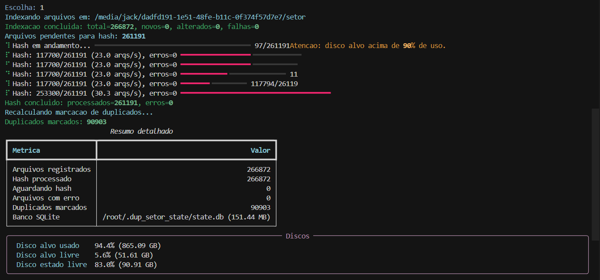
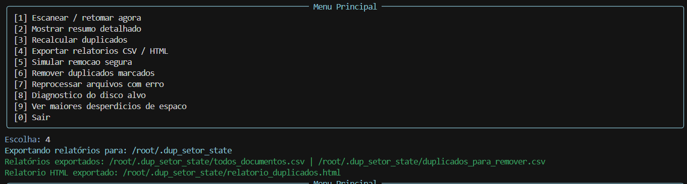
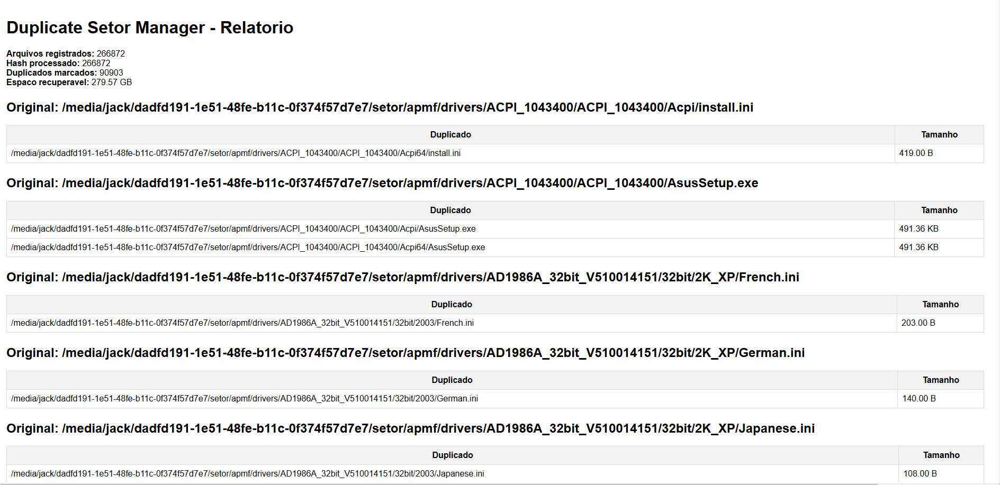

# 🔍 Gerenciador de Duplicados Resiliente (Python)

📅 Evolução de um projeto iniciado em 2018  
🔧 Versão reescrita em Python com melhorias de usabilidade e controle  

---

## 🧠 Visão Geral

Este projeto é uma ferramenta de detecção e gerenciamento de arquivos duplicados, desenvolvida para operar em ambientes reais com poucos recursos e sem estrutura avançada.

Foi criado com base em cenários práticos onde:

- computadores simples eram usados como servidores  
- arquivos eram duplicados entre pastas compartilhadas  
- havia pouco espaço em disco  
- era necessário preparar ambientes para backup  

---

## ⚙️ Problema Resolvido

Em ambientes reais, é comum encontrar:

- arquivos duplicados espalhados em várias pastas  
- cópias desnecessárias ocupando espaço  
- dificuldade em identificar o que pode ser removido com segurança  

A ferramenta resolve isso de forma controlada e segura.

---

## 🚀 Funcionalidades

- Indexação de arquivos com persistência em SQLite  
- Retomada automática (continua de onde parou)  
- Cálculo de hash SHA-256 em streaming (baixo uso de memória)  
- Detecção de duplicados baseada em conteúdo real  
- Exportação de relatórios CSV  
- Geração de relatório HTML  
- Simulação de remoção (dry-run)  
- Remoção com confirmação explícita  
- Reprocessamento de arquivos com erro  
- Monitoramento de uso de disco  
- Diagnóstico de saúde do disco (quando disponível)  
- Interface interativa (com suporte à biblioteca Rich)  

---

## 🔐 Segurança

O sistema foi projetado para evitar perda de dados:

- nenhum arquivo é removido automaticamente  
- remoção exige confirmação manual (EXCLUIR)  
- existe modo de simulação antes da exclusão  
- erros são registrados e podem ser reprocessados  
- estado persistente evita reprocessamento desnecessário  

---

## 📸 Exemplos

### Resultado da varredura


### Exportação de relatórios


### Relatório HTML


---

## ▶️ Como usar

```bash
python3 duplicate_manager.py --target "/caminho/do/diretorio"
```

Parâmetros opcionais:

```bash
--state-dir "/caminho/estado"
--run-once
```

---

## 📁 Arquivos gerados

- state.db → banco SQLite com estado dos arquivos  
- todos_documentos.csv → inventário completo  
- duplicados_para_remover.csv → lista de duplicados  
- relatorio_duplicados.html → relatório visual  

---

## 🧠 Destaques Técnicos

Este projeto demonstra:

- processamento incremental de arquivos  
- uso de SQLite para persistência  
- hashing eficiente com baixo uso de memória  
- controle de fluxo seguro para operações destrutivas  
- abordagem prática para problemas reais de armazenamento  

---

## 🧰 Contexto de Uso

Ferramenta pensada para cenários como:

- servidores Samba simples  
- pequenas empresas  
- ambientes sem infraestrutura dedicada  
- preparação de backups  
- análise de disco em máquinas locais  

---

## 👨‍💻 Autor

Jackson Zacarias  
Cybersecurity | DFIR | Automação  

LinkedIn:  
https://www.linkedin.com/in/jacksonzacarias/

---

## 🏁 Considerações finais

Este projeto representa uma solução prática para um problema comum em ambientes reais:

identificar e gerenciar arquivos duplicados com segurança, sem risco de perda de dados.
